# AI DevTracker 사용자 매뉴얼

AI DevTracker는 AI 도구와 함께 진행하는 프로젝트의 현재 상태, 중단 지점, 다음 작업을 기록하는
로컬 프로젝트 관리 도구입니다. 이 문서는 실제 화면과 현재 코드에 맞춰 기본 설치부터 일상적인
사용법과 백업까지 설명합니다.

> **중요:** AI DevTracker는 개인용 로컬 앱이며 기본 인증 기능이 없습니다. API와 터미널 기능은
> 로컬 개발 환경에서만 사용하고, 인증 없이 외부 네트워크에 공개하지 마세요.

## 1. 소개

AI DevTracker의 핵심 질문은 **“어디까지 했고, 다음에 무엇을 하는가?”**입니다.
프로젝트별로 작업, 중단·재개 메모, 실행 환경, Git 정보, 프롬프트, 이슈, 문서, 테스트,
비용과 프로젝트 간 관계를 한 곳에 모을 수 있습니다.

데이터는 SQLite 파일에 저장되며, 별도의 외부 데이터베이스나 로그인 계정이 필요하지 않습니다.
프로젝트와 기록을 JSON으로 백업하거나 프로젝트별 Markdown으로 내보낼 수도 있습니다.

## 2. 설치와 실행

### 요구 사항

- Node.js 20 이상 (22 LTS 또는 24)
- npm 10
- 터미널을 사용할 경우 `node-pty`가 동작하는 로컬 셸 환경

### 기본 실행

저장소 루트에서 다음을 실행합니다.

```bash
npm install
npm run migrate
npm run seed
npm run dev
```

브라우저에서 <http://localhost:5173>을 열고, API 상태는
<http://localhost:3001/api/health>에서 확인합니다.

`npm run dev`는 서버와 Vite 클라이언트를 함께 실행합니다.
Vite 개발 서버는 5173 포트에서 실행되며 `/api` 요청을 API 서버 포트(기본 3001)로 프록시합니다.
3001 포트를 다른 서비스가 사용 중이면 저장소 루트에 `.env` 파일을 만들고 `PORT=3101`처럼
지정하세요. 서버와 Vite 프록시가 같은 `.env`를 읽으므로 한 곳만 바꾸면 됩니다
(`.env.example` 참고). 값을 바꾼 뒤에는 `npm run dev`를 다시 시작합니다.
서버가 시작될 때 최신 마이그레이션과 검색 인덱스 재생성이 자동으로 수행됩니다.

### 환경 변수

저장소 루트의 `.env`(또는 `server/.env`)에 설정합니다. 기본값은 `.env.example`을 참고하세요.

| 변수 | 기본값/예시 | 설명 |
| --- | --- | --- |
| `PORT` | `3001` | Express API 서버 포트 |
| `DB_PATH` | `./data/devtracker.db` | SQLite 파일 경로. `:memory:`도 테스트에 사용할 수 있습니다. |
| `CLIENT_ORIGIN` | `http://localhost:5173` | CORS에서 허용할 클라이언트 Origin |
| `TERMINAL_ENABLED` | 미설정(활성) | `false`로 설정하면 터미널 WebSocket을 비활성화 |
| `SHELL` | 운영체제 기본 셸 | 터미널 탭에서 실행할 셸. 미설정 시 Windows는 `COMSPEC`(cmd.exe), 그 외는 `bash` |
| `NODE_ENV` | 미설정 | `test`이면 서버를 직접 listen하지 않음 |

예를 들어 별도 데이터베이스와 포트로 서버를 실행할 수 있습니다.

```bash
DB_PATH=/tmp/devtracker-guide.db PORT=3101 npm run start -w server
```

이렇게 명령줄에서 `PORT`를 지정하면 서버만 바뀌므로, 개발 클라이언트와 함께 쓸 때는
루트 `.env`의 `PORT`를 사용하세요. Vite 프록시가 같은 값을 읽습니다.

### 시드 데이터 초기화

시드 명령은 기존 프로젝트, 작업, 메모, 프롬프트, 이슈, 문서, 설정, 배포·테스트 기록,
비용과 관계를 비운 뒤 예제 데이터를 다시 넣습니다.

```bash
npm run seed
```

따라서 작업 중인 데이터를 보존해야 할 때는 먼저 백업하세요. 완전히 새 데이터베이스로
시작하려면 기본 SQLite 파일을 삭제한 뒤 마이그레이션과 시드를 다시 실행합니다.

```bash
rm -f server/data/devtracker.db
npm run migrate
npm run seed
```

## 3. 화면 구성

왼쪽 사이드바에서 다음 화면으로 이동합니다.

- **대시보드:** 진행 중 프로젝트, 다음 할 일, 막힌 작업, 최근 변경, 마감 임박 프로젝트와
  일정 캘린더를 확인합니다.
- **프로젝트:** 프로젝트를 카드 또는 목록으로 조회하고 생성·수정·삭제합니다.
- **비용:** AI 도구, 서버, 기타 비용을 기간별로 집계하고 관리합니다.
- **AI ROI:** 현재 SaaS·시스템 유지비와 AI로 직접 개발할 때의 비용 및 절감 효과를 비교합니다.
- **관계도:** 프로젝트 간 관계를 SVG 그래프로 확인합니다.
- **검색:** 프로젝트, 작업, 프롬프트, 문서, 이슈를 통합 검색합니다.
- **백업:** 전체 또는 프로젝트별 JSON/Markdown을 내보내고 JSON을 복원합니다.

화면 오른쪽 위에는 현재 로컬 개인 워크스페이스가 표시됩니다. 사이드바 하단에는 LUDA 로고,
슬로건, 연락처, 저작권 문구가 표시됩니다.

## 4. 대시보드

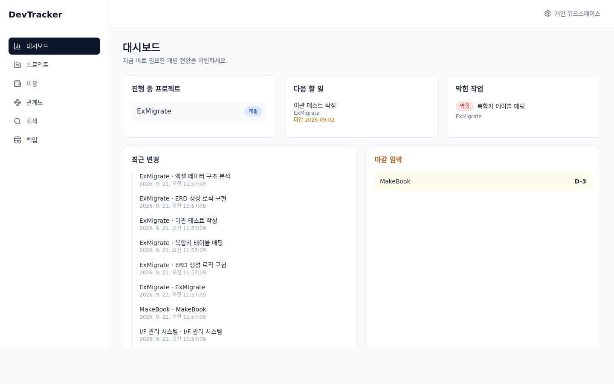

대시보드는 로그인 없이 앱을 열었을 때 가장 먼저 보는 개발 현황판입니다.

- **진행 중 프로젝트:** 상태가 `개발` 또는 `테스트`인 프로젝트를 표시합니다.
- **다음 할 일:** 프로젝트별로 가장 먼저 처리할 `할 일` 작업을 한 건씩 보여 줍니다.
  마감일이 있으면 `마감 YYYY-MM-DD`도 함께 표시합니다.
- **막힌 작업:** 상태가 `막힘`인 작업과 소속 프로젝트를 표시합니다.
- **최근 변경:** 최근 7일 동안 변경된 작업, 중단·재개 메모, 프로젝트를 최신순으로 보여 줍니다.
  기본으로 5건만 표시되며 `더 보기 (N)`을 누르면 나머지가 펼쳐지고 `접기`로 다시 줄일 수 있습니다.
- **마감 임박:** 완료·중단 상태가 아니면서 목표일이 7일 이내인 프로젝트를 표시합니다.
- **서비스 포트:** 설정 탭 실행 포트가 등록된 프로젝트 목록입니다. 로컬에서 포트가 열려
  있으면 녹색(실행 중), 닫혀 있으면 회색(정지)으로 표시되며 새로고침 버튼으로 다시 확인합니다.
  실행 명령어가 설정된 정지 서비스는 소스 폴더에서 백그라운드로 실행할 수 있고,
  이 앱이 실행한 프로세스는 중지할 수 있습니다. 앱 서버를 재시작하면 기존 프로세스가
  계속 실행 중이어도 목록에서 추적이 끊길 수 있습니다. 실행 명령어는 여러 줄로 입력할 수
  있으며 위에서부터 순서대로 실행됩니다. Windows에서는 PowerShell, Linux/macOS에서는
  bash로 실행하고, 한 줄이라도 실패하면 뒤의 줄을 실행하지 않습니다.
- **일정 캘린더:** 프로젝트 시작일(`시작`), 목표일(`목표`), 완료되지 않은 작업의 마감일
  (`작업 마감`)을 표시합니다.

캘린더의 프로젝트 이벤트를 클릭하면 해당 프로젝트 개요로 이동하고, 작업 마감 이벤트를
클릭하면 해당 프로젝트의 작업 탭으로 이동합니다. 하루에 이벤트가 세 개 이상이면 앞의 두
개만 표시하고 나머지는 `+N`으로 묶습니다. `이전`과 `다음`으로 월을 이동할 수 있습니다.

## 5. 프로젝트

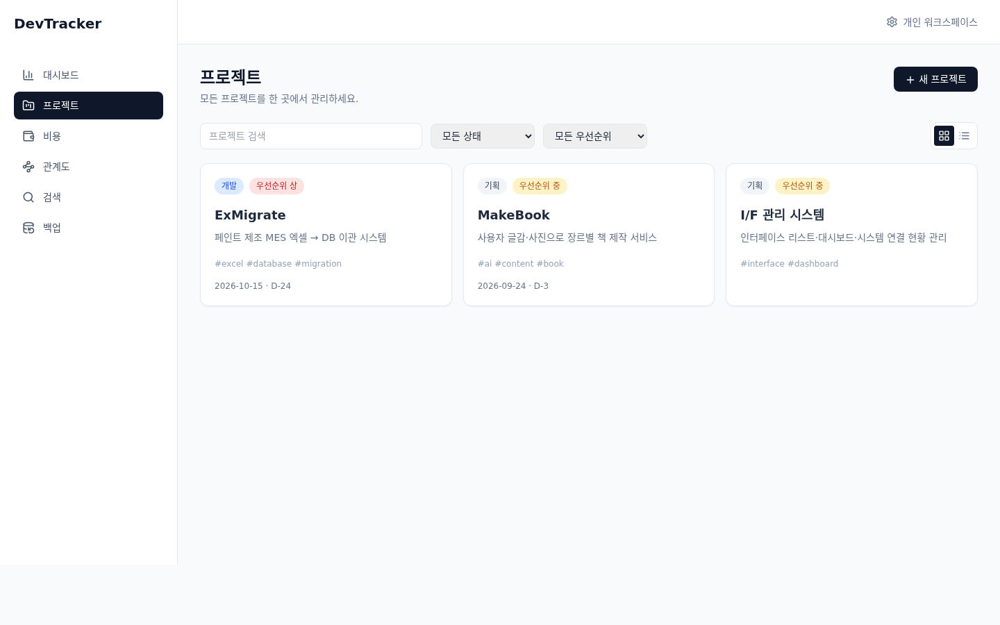

프로젝트 화면에서는 `새 프로젝트` 버튼으로 다음 정보를 입력합니다.

- 프로젝트 이름(필수)
- 그룹(기존 그룹 자동완성 및 그룹별 필터에 사용)
- 목적
- 상태
- 우선순위
- 시작일과 목표일
- 태그(쉼표로 구분)

상태는 `기획`, `개발`, `테스트`, `배포`, `완료`, `중단`이며 내부 값은 각각
`planning`, `development`, `testing`, `deployed`, `completed`, `paused`입니다.
우선순위는 `상`, `중`, `하`(`high`, `medium`, `low`)입니다.

목록 위의 필터를 사용하면 프로젝트 이름 검색, 상태, 우선순위, 그룹으로 결과를 좁힐 수 있습니다.
그룹이 지정된 프로젝트는 카드 보기에서 그룹별 섹션으로 묶이고, 카드에 그룹 칩이 표시됩니다.
오른쪽의 카드/목록 아이콘으로 보기 방식을 바꿀 수 있습니다. 카드와 목록의 프로젝트 이름을
클릭하면 상세 화면으로 이동합니다. 목표일이 있으면 D-day도 표시됩니다.

D-day 표기 규칙은 다음과 같습니다.

- `D-N`: 목표일까지 N일 남음
- `D-day`: 오늘이 목표일
- `D+N`(빨간색): 목표일이 N일 지났음
- 상태가 `완료`인 프로젝트는 D-day 대신 `완료 · N일 소요`(시작일~목표일)로 표시됩니다.

프로젝트 상세의 `수정` 버튼으로 같은 정보를 변경할 수 있고 `삭제` 버튼으로 프로젝트를
삭제합니다. 삭제하면 연결된 작업·메모·설정·문서 등의 프로젝트 데이터가 함께 제거되며,
프로젝트 관계는 삭제됩니다. 프로젝트에 연결된 비용은 공통 비용으로 남을 수 있으므로,
삭제 전 비용 목록을 확인하세요.

## 6. 프로젝트 상세 탭

프로젝트 이름을 클릭하면 `개요`, `작업`, `실행 화면`, `터미널`, `프롬프트`, `문서`,
`이슈`, `테스트`, `관계`, `설정` 탭을 사용할 수 있습니다. 헤더의 `JSON`과 `MD` 링크로
현재 프로젝트 백업도 바로 다운로드할 수 있습니다.

### 6.1 개요

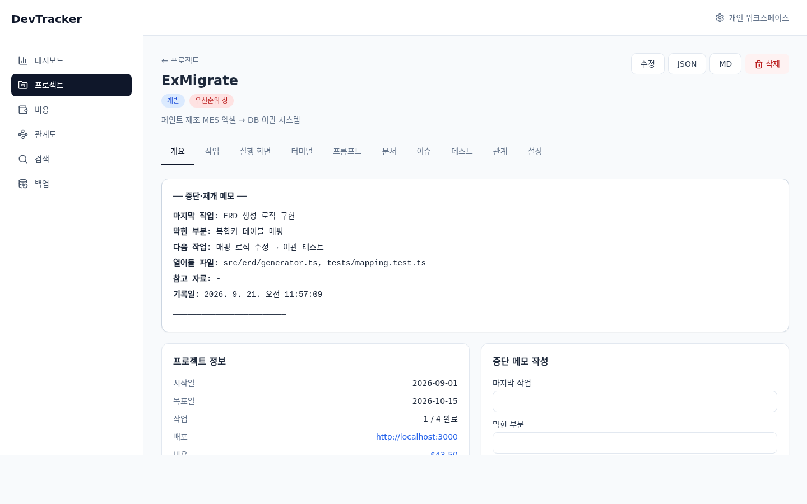

개요에는 가장 최근의 중단·재개 메모, 프로젝트 정보, 새 메모 입력 폼과 메모 기록이
표시됩니다.

메모에는 다음 내용을 남깁니다.

- 마지막 작업(필수)
- 막힌 부분
- 다음 작업
- 열어둘 파일(쉼표로 구분)
- 참고 자료

프로젝트 정보 카드에는 시작일, 목표일, 완료 작업 수, 배포 서비스 URL이 표시됩니다.
비용이 있으면 통화별 합계가 링크로 표시되며, 클릭하면 해당 프로젝트로 필터된 비용 화면으로
이동합니다.

### 6.2 작업

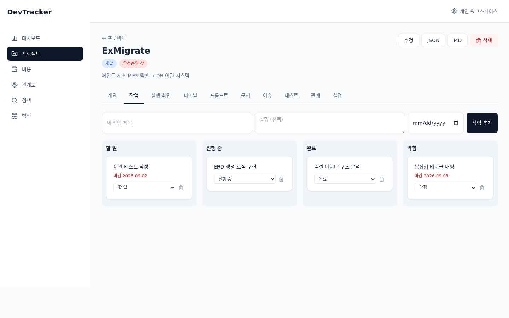

작업 탭의 입력 폼에서 작업 제목, 설명, 선택적인 마감일을 입력해 작업을 추가합니다.
작업은 `할 일`, `진행 중`, `완료`, `막힘` 네 개의 보드 열로 나뉩니다.

작업 카드의 상태 선택으로 상태를 변경하고 휴지통 아이콘으로 삭제합니다. 마감일이 있는
미완료 작업은 카드에 날짜가 표시되며, 지난 마감일은 빨간색으로 강조됩니다. 작업의
내부 상태 값은 `todo`, `in_progress`, `done`, `blocked`입니다.

### 6.3 프롬프트

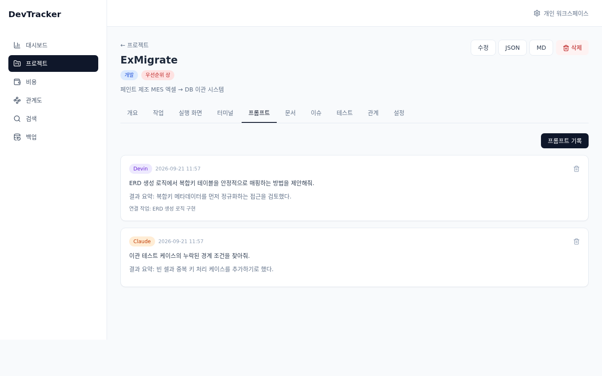

`프롬프트 기록`을 눌러 AI 사용 기록을 추가합니다.

- 도구: Devin, Claude, Cursor, 기타
- 연결 작업: 해당 프로젝트의 작업 또는 연결 안 함
- 프롬프트 내용(필수)
- 결과 요약
- 커밋 해시

긴 프롬프트는 처음에 접힌 상태로 표시되며 `더보기`와 `접기`로 전환합니다. 기록의
휴지통 아이콘으로 삭제할 수 있습니다.

### 6.4 이슈

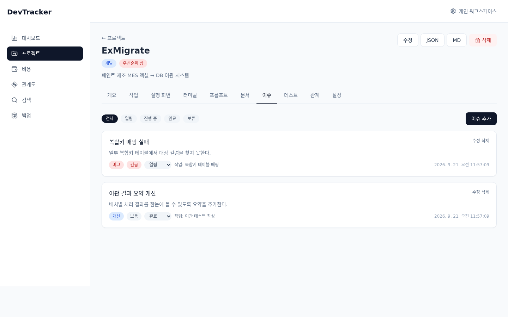

이슈는 제목, 유형, 우선순위, 상태, 연결 작업, 설명을 기록합니다. 유형은 버그·개선·
아이디어·질문, 우선순위는 긴급·높음·보통·낮음, 상태는 열림·진행 중·완료·보류입니다.

상단 필터로 상태별 이슈를 볼 수 있습니다. 이슈 카드에서 상태를 바로 변경하거나 `수정`,
`삭제`를 사용할 수 있습니다.

### 6.5 문서

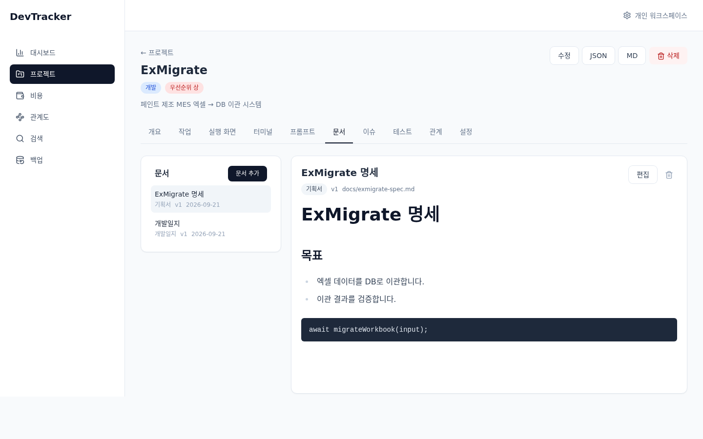

문서 탭의 왼쪽 목록에서 문서를 선택하고 오른쪽에서 내용을 확인합니다. `문서 추가` 또는
`편집`으로 제목, 문서 유형, 출처 위치, Markdown 내용을 입력합니다.

문서 유형은 기획서(`spec`), 요구사항(`requirement`), 설계(`design`), 개발일지(`devlog`),
README(`readme`), 노트(`note`)입니다. 본문은 Markdown과 GFM 문법으로 미리보기되며, 수정
저장 시 버전이 증가합니다. 문서 삭제 전에는 확인 창이 표시됩니다.

### 6.6 테스트 기록

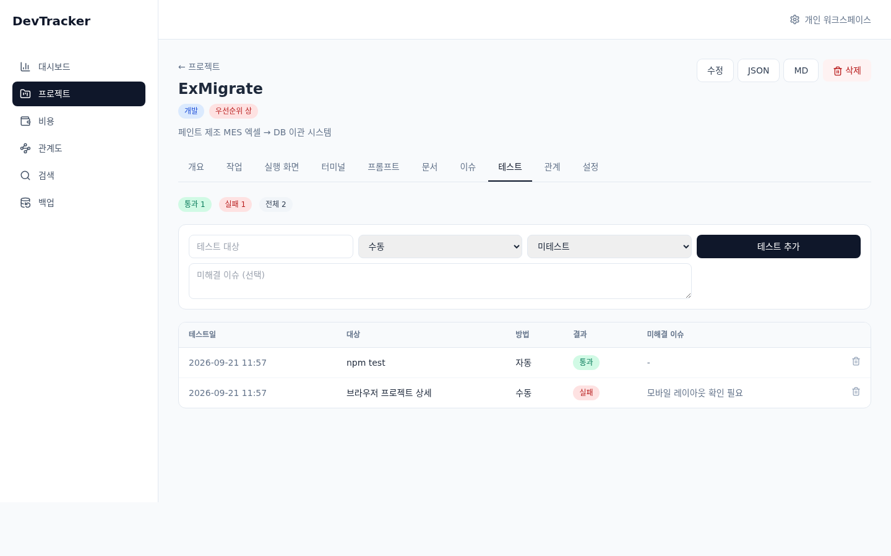

테스트 탭 상단에서 통과·실패·전체 개수를 확인합니다. 입력 폼에는 테스트 대상, 방법,
결과, 미해결 이슈를 입력합니다.

- 방법: 수동, 자동, 브라우저
- 결과: 통과, 실패, 미테스트

테스트일, 대상, 방법, 결과, 미해결 이슈가 표에 기록됩니다. 행의 삭제 아이콘을 누르면
확인 후 기록을 삭제합니다.

### 6.7 실행 화면

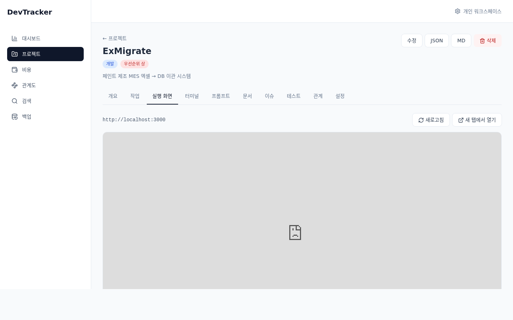

설정 탭의 접속 URL 또는 실행 포트를 설정하면 해당 주소를 iframe으로 표시합니다.
`새로고침`으로 iframe을 다시 불러오고 `새 탭에서 열기`로 독립 브라우저 탭에서 열 수
있습니다.

실행 중인 서비스가 실제로 떠 있어야 하며, 대상 서비스가 `X-Frame-Options` 또는
`Content-Security-Policy`로 iframe 임베드를 막으면 빈 화면이 나올 수 있습니다. 이 경우
`새 탭에서 열기`를 사용하세요.

### 6.8 터미널

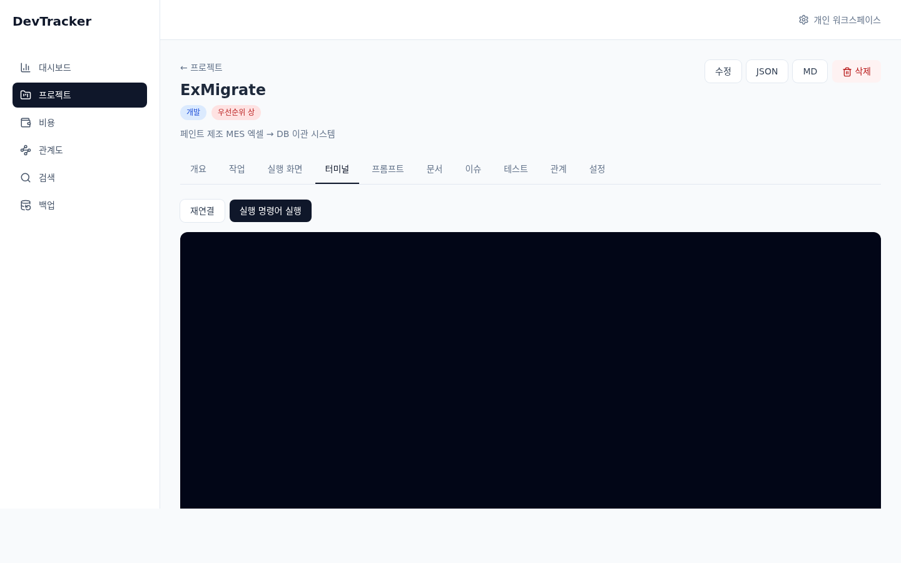

터미널 탭은 브라우저와 서버 사이에 WebSocket 터미널을 연결합니다. 프로젝트의 실행 환경에
소스 폴더가 있고 해당 경로가 실제로 존재하면 그 경로를 현재 작업 디렉터리(cwd)로 사용하며,
그렇지 않으면 서버 프로세스의 홈 디렉터리를 사용합니다. 셸은 `SHELL` 환경 변수로 선택하며, 미설정 시 Windows는 `COMSPEC`(cmd.exe), 그 외는 `bash`를 사용합니다. 루트 `.env`에 `SHELL=powershell.exe`처럼 지정할 수도 있습니다.

`run_command`가 설정되어 있으면 `실행 명령어 실행` 버튼이 나타나며, 설정된 명령을 터미널에
입력합니다. 여러 줄 명령은 비어 있지 않은 각 줄을 순서대로 전송합니다. `재연결`로 연결을 다시 만들 수 있습니다. 터미널은 localhost 연결만 허용하고,
서버를 `TERMINAL_ENABLED=false`로 시작하면 비활성화됩니다.

터미널은 임의의 셸 명령을 실행할 수 있으므로 개인 로컬 환경에서만 사용하세요.

### 6.9 관계

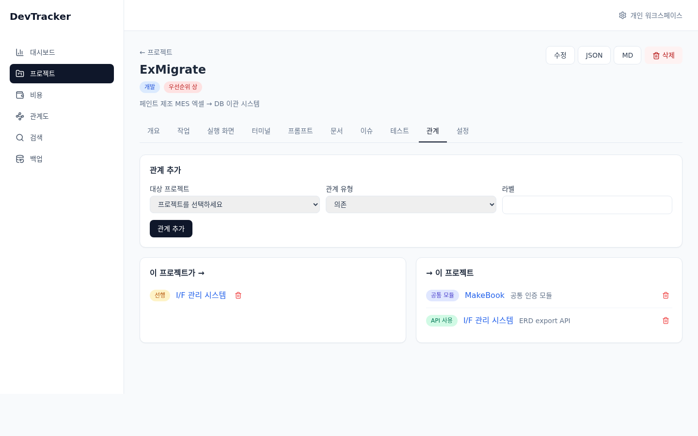

관계 추가 폼에서 대상 프로젝트, 관계 유형, 라벨을 입력합니다. 자기 자신은 대상 목록에서
제외됩니다. 저장한 관계는 다음 두 목록으로 나뉩니다.

- **이 프로젝트가 →:** 현재 프로젝트가 출발점인 관계
- **→ 이 프로젝트:** 현재 프로젝트가 도착점인 관계

관계 유형은 의존(`depends_on`), 공통 모듈(`shares_module`), API 사용(`uses_api`), 선행
(`precedes`)입니다. 상대 프로젝트 이름을 클릭하면 해당 프로젝트의 관계 탭으로 이동하고,
삭제 아이콘으로 관계를 제거합니다.

### 6.10 설정

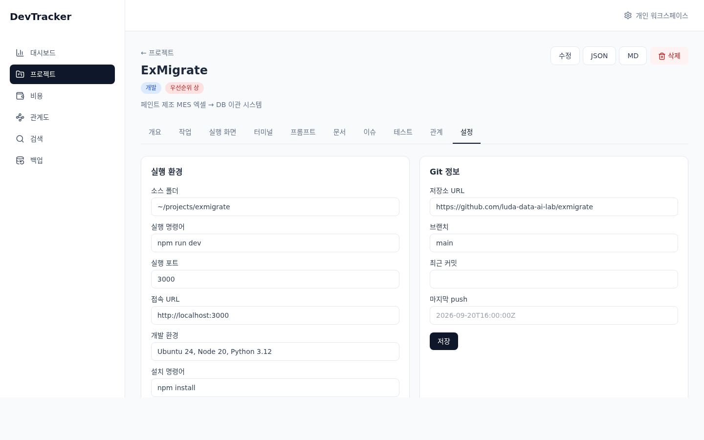

설정 탭은 실행 환경, Git 정보, 배포 정보 세 카드를 제공합니다.

**실행 환경**

- 소스 폴더
- 실행 명령어
- 실행 포트
- 접속 URL
- 개발 환경
- 설치 명령어
- 환경변수 위치
- DB 설정 경로

실행 명령어는 한 줄에 명령 하나씩 입력할 수 있습니다. 서비스 포트에서 실행하면
Windows는 PowerShell, Linux/macOS는 bash 스크립트로 위에서부터 순서대로 실행하며,
실패한 줄에서 전체 실행을 멈춥니다. Windows 가상환경은
`.venv\Scripts\Activate.ps1`처럼 PowerShell 명령으로 입력하세요.

**Git 정보**

- 저장소 URL
- 브랜치
- 최근 커밋
- 마지막 push

**배포 정보**

- 서비스 URL
- 인프라
- 버전
- 배포일
- 배포 방법

각 카드의 `저장` 버튼은 프로젝트별 설정을 생성하거나 갱신합니다. 개요의 배포 URL과
실행 화면·터미널의 동작은 이 설정을 사용합니다.

## 7. 통합 검색

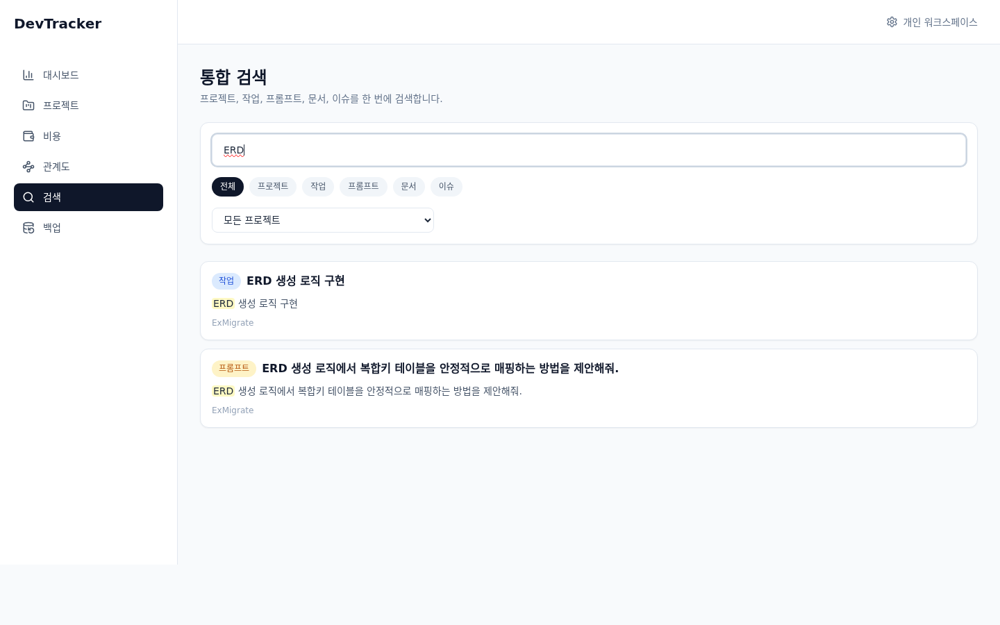

검색 화면은 프로젝트, 작업, 프롬프트, 문서, 이슈를 한 번에 검색합니다. 검색어를 입력하면
약 300ms 후 자동으로 검색하고 URL의 `q`, `type`, `project` 파라미터도 동기화합니다.

검색 대상은 다음과 같습니다.

- 프로젝트 이름과 목적
- 작업 제목과 설명
- 프롬프트 내용과 결과 요약
- 문서 제목과 본문
- 이슈 제목과 설명

검색어는 FTS5 접두어 검색으로 처리되며 여러 단어를 입력하면 토큰을 함께 검색합니다.
따옴표는 검색어 정리 과정에서 제거됩니다. `전체`, 프로젝트, 작업, 프롬프트, 문서,
이슈 칩과 프로젝트 선택 필터를 조합할 수 있습니다. 결과의 강조된 부분을 확인하고
카드를 클릭하면 해당 프로젝트 또는 프로젝트의 관련 탭으로 이동합니다.

## 8. 비용 관리

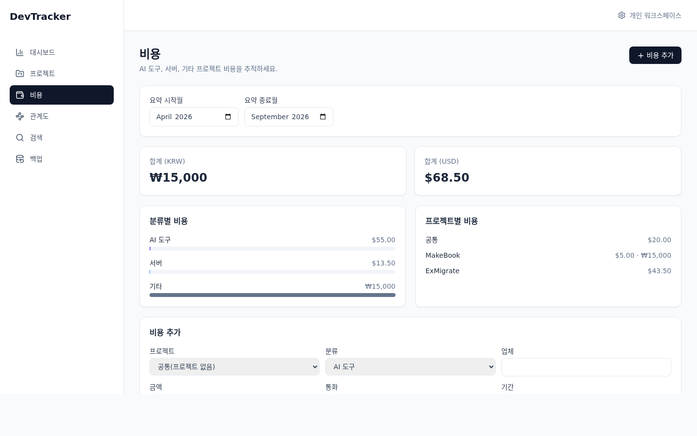

비용 화면은 AI 도구, 서버, 기타 비용을 관리합니다. 요약 시작월과 종료월을 지정하면
해당 기간의 통화를 기준으로 합계가 계산됩니다.

- 분류: AI 도구(`ai_tool`), 서버(`server`), 기타(`other`)
- 통화: KRW 또는 USD
- 기간: `YYYY-MM`
- 프로젝트: 특정 프로젝트 또는 `공통(프로젝트 없음)`

상단에는 KRW/USD 합계가 표시되고, 분류별 막대와 프로젝트별 합계가 이어집니다. 비용 추가
폼에는 프로젝트, 분류, 업체, 금액, 통화, 기간, 메모를 입력합니다. 금액은 0 이상이어야
하며 비용 표에서 기간·분류·프로젝트로 필터링할 수 있습니다.

표의 수정 아이콘은 입력 폼을 수정 모드로 바꾸고, 삭제 아이콘은 확인 후 비용을 삭제합니다.
프로젝트 상세 개요에 표시되는 비용 합계는 해당 프로젝트의 전체 기간 기록을 통화별로 합산한
값이며, 클릭하면 `/costs?project=<프로젝트 ID>`로 이동합니다.

### 8.1 AI ROI 계산기

AI ROI 화면은 SaaS 구독 또는 자체 시스템 유지보수 항목마다 현재 월 비용, AI로 개발할 때의
초기 개발비와 월 운영비를 비교합니다. 선택적으로 프로젝트를 연결하고, 기존 방식으로 개발할
때의 견적과 메모를 기록할 수 있습니다. 비교 기간은 1년, 3년, 5년 중 선택합니다.

- 월 절감액은 `현재 월 비용 - AI 개발 후 월 운영비`, 연간 절감액은 월 절감액에 12를 곱합니다.
- 선택한 기간의 현재 총비용은 `현재 월 비용 × 12 × 기간`, AI 총비용은
  `AI 초기 개발비 + AI 월 운영비 × 12 × 기간`입니다. 순이익은 현재 총비용에서 AI 총비용을
  뺀 값이며, ROI는 순이익을 AI 초기 개발비로 나눈 백분율입니다.
- 투자 회수 기간은 AI 초기 개발비를 월 절감액으로 나눈 개월 수입니다. 월 절감액이 0 이하이면
  비용을 줄이지 못하므로 **회수 불가**로 표시합니다. 초기 개발비가 0이고 월 절감액이 양수이면
  `즉시` 회수로 표시합니다.
- 기존 방식 개발 견적을 입력하면 해당 견적에서 AI 초기 개발비를 뺀 개발비 절감액도 표시됩니다.

이 화면의 모든 비용은 원화(KRW) 기준이며 통화 선택이나 환산은 지원하지 않습니다.

## 9. 관계도

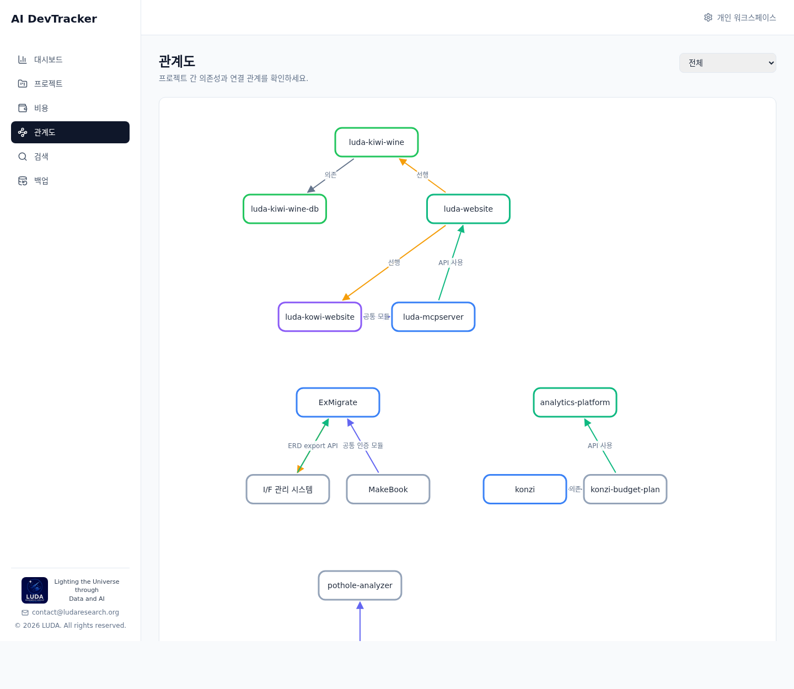

관계도는 관계가 있는 프로젝트만 그래프에 표시합니다. 서로 연결된 프로젝트끼리 하나의
묶음(클러스터)으로 원형 배치되고, 묶음들은 캔버스에 좌우로 나열되어 프로젝트가 많아도
노드가 겹치지 않습니다. 관계가 하나도 없는 프로젝트는 그래프 아래 `관계 없는 프로젝트 (N)`
목록에 칩으로 표시되며 클릭하면 상세 화면으로 이동합니다.

오른쪽 위의 선택 박스에서 `전체` 또는 프로젝트 그룹을 고를 수 있습니다. 그룹을 선택하면 그
그룹에 속한 프로젝트와 그룹 내부 관계만 표시됩니다. 그룹이 없는 프로젝트는 `미분류`로 묶입니다.

노드 테두리 색은 프로젝트 상태를 나타내며 프로젝트 노드를 클릭하면 상세 화면으로 이동합니다.
관계선은 노드 테두리에서 시작해 화살표로 끝나고, 선 가운데에는 관계 라벨이 표시됩니다
(라벨이 없으면 관계 유형명).

관계 유형의 의미와 색상은 다음과 같습니다.

| 유형 | 의미 | 그래프 색상 |
| --- | --- | --- |
| 의존 (`depends_on`) | 출발 프로젝트가 대상 프로젝트에 의존 | 회색 |
| 공통 모듈 (`shares_module`) | 두 프로젝트가 모듈을 공유 | 남색 |
| API 사용 (`uses_api`) | 출발 프로젝트가 대상 프로젝트의 API를 사용 | 초록 |
| 선행 (`precedes`) | 출발 프로젝트가 대상 프로젝트보다 먼저 진행 | 주황 |

화살표 방향과 관계 탭의 출발/도착 목록을 함께 보면 프로젝트 간 순서를 해석할 수 있습니다.
관계가 하나도 없으면 빈 상태 메시지가 표시됩니다.

## 10. 백업과 복원

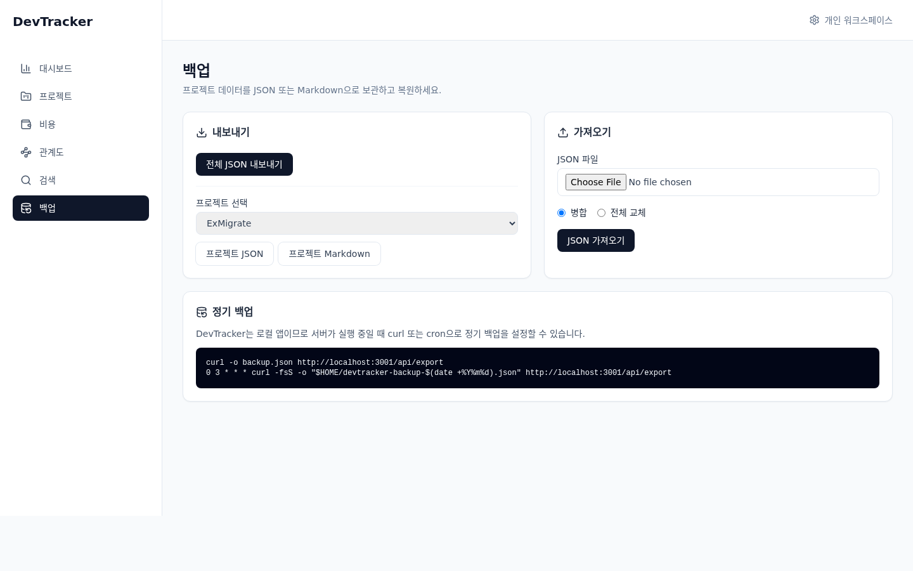

백업 화면의 **내보내기** 카드에서 전체 JSON, 선택한 프로젝트의 JSON, 선택한 프로젝트의
Markdown을 다운로드할 수 있습니다. JSON 백업에는 프로젝트와 프로젝트별 기록뿐 아니라 비용,
프로젝트 관계도 포함됩니다.

**가져오기**에서는 `.json` 파일을 선택하고 다음 모드를 고릅니다.

- **병합:** ID가 같은 레코드는 갱신하고 새 ID는 추가합니다.
- **전체 교체:** 기존 데이터를 삭제한 뒤 파일의 데이터를 가져옵니다. 선택 시 확인 창이
  표시되며, 앱의 전체 데이터가 지워지므로 먼저 백업해야 합니다.

가져오기가 끝나면 테이블별 반영 레코드 수가 표시됩니다. 다른 프로젝트를 가리키지 않는
관계와 존재하지 않는 프로젝트 ID를 가진 비용은 건너뛰어 데이터베이스의 외래 키 오류를
방지합니다.

명령줄과 cron으로도 전체 JSON을 저장할 수 있습니다.

```bash
curl -o backup.json http://localhost:3001/api/export

# 매일 새벽 3시
0 3 * * * curl -fsS -o "$HOME/devtracker-backup-$(date +\%Y\%m\%d).json" \
  http://localhost:3001/api/export
```

백업 파일에는 인증 정보나 비밀 키를 넣지 말고 안전한 로컬 위치에 보관하세요. 전체 교체
가져오기는 되돌릴 수 없으므로 실행 전에 현재 데이터의 별도 백업을 권장합니다.

## 11. API 요약

API 응답은 일반적으로 `{ success: true, data }` 또는 `{ success: false, error }` 형식입니다.
다운로드용 export 응답은 파일 본문이므로 성공 envelope 없이 JSON payload 자체를 반환합니다.

| 기능 | 주요 경로 |
| --- | --- |
| 프로젝트 | `GET/POST/PUT/DELETE /api/projects` |
| 작업 | `GET/POST /api/projects/:id/tasks`, `PUT/DELETE /api/tasks/:id` |
| 중단·재개 메모 | `GET/POST /api/projects/:id/memos`, `GET /api/projects/:id/memos/latest` |
| 실행 환경/Git/배포 | `GET/PUT /api/projects/:id/env`, `/git`, `/deploy` |
| 프롬프트/이슈/문서 | 프로젝트별 `GET/POST`, 항목별 `PUT/DELETE` |
| 테스트 | `GET/POST /api/projects/:id/tests`, `DELETE /api/tests/:id` |
| 관계 | `GET/POST /api/projects/:id/relations`, `DELETE /api/relations/:id` |
| 관계도 | `GET /api/relations/graph` |
| 비용 | `GET/POST /api/costs`, `PUT/DELETE /api/costs/:id`, `GET /api/costs/summary` |
| AI ROI | `GET /api/roi`, `GET /api/roi/summary?years=`, `POST /api/roi`, `PUT/DELETE /api/roi/:id` |
| 통합 검색 | `GET /api/search?q=&type=&project=` |
| 대시보드 | `GET /api/dashboard` |
| 서비스 포트 | `GET /api/services` |
| 서비스 실행 | `POST /api/services/:id/start` |
| 서비스 중지 | `POST /api/services/:id/stop` |
| 서비스 로그 | `GET /api/services/:id/logs` |
| 터미널 상태 | `GET /api/terminal/status` |
| 백업/복원 | `GET /api/export`, `GET /api/export/projects/:id`, `POST /api/import?mode=merge\|replace` |
| 상태 확인 | `GET /api/health` |

전체 개발자용 목록은 저장소의 [README API 요약](../README.md#api-요약)을 참고하세요.

## 12. 문제 해결

### 포트 충돌

API 포트(기본 3001)를 다른 프로세스가 사용하면 루트 `.env`에 `PORT=3101`처럼 다른 포트를
지정하고 `npm run dev`를 다시 시작합니다. 서버와 Vite의 API/WebSocket 프록시가 모두 이 값을
따릅니다. 5173 포트 충돌은 `client/vite.config.js`의 `server.port`를 변경합니다.

### 데이터베이스 초기화

`DB_PATH`가 가리키는 SQLite 파일을 백업한 뒤 삭제하고 다음을 실행합니다.

```bash
rm -f server/data/devtracker.db
npm run migrate
npm run seed
```

단순히 예제 데이터만 다시 넣으려면 `npm run seed`를 실행합니다. 시드는 기존 도메인
데이터를 지우므로 주의하세요.

### 터미널이 열리지 않음

`GET /api/terminal/status`로 활성화 여부를 확인합니다. 서버를
`TERMINAL_ENABLED=false`로 실행했다면 값을 제거하거나 `true`로 바꾸고 재시작합니다.
터미널은 localhost 연결만 허용하며, 프로젝트의 소스 폴더가 존재하지 않으면 홈 디렉터리에서
열립니다. `node-pty` 설치 문제도 확인하세요.

### 실행 화면이 비어 있음

설정 탭에 접속 URL 또는 실행 포트가 입력되어 있는지, 대상 서비스가 실행 중인지 확인합니다.
대상 서비스가 iframe을 차단하는 `X-Frame-Options` 또는 CSP 헤더를 보내면 `새 탭에서 열기`를
사용합니다.

### 마이그레이션 오류

서버는 시작 시 `db.migrate.latest()`를 호출해 마이그레이션을 자동 실행합니다. 수동으로
상태를 맞추려면 같은 `DB_PATH`를 사용해 `npm run migrate`를 실행합니다. FTS5를 지원하지
않는 SQLite 빌드에서는 검색 인덱스 마이그레이션이 실패할 수 있으므로 FTS5 지원 빌드를
사용하세요.

## 13. 부록: enum 값

화면에는 한국어 라벨로 표시되지만 API와 데이터베이스에는 다음 영문 값이 저장됩니다.

| 항목 | 값 |
| --- | --- |
| 프로젝트 상태 | `planning`, `development`, `testing`, `deployed`, `completed`, `paused` |
| 프로젝트 우선순위 | `high`, `medium`, `low` |
| 작업 상태 | `todo`, `in_progress`, `done`, `blocked` |
| AI 도구 | `devin`, `claude`, `cursor`, `other` |
| 이슈 유형 | `bug`, `improvement`, `idea`, `question` |
| 이슈 상태 | `open`, `in_progress`, `done`, `hold` |
| 이슈 우선순위 | `urgent`, `high`, `normal`, `low` |
| 문서 유형 | `spec`, `requirement`, `design`, `devlog`, `readme`, `note` |
| 테스트 방법 | `manual`, `auto`, `browser` |
| 테스트 결과 | `pass`, `fail`, `untested` |
| 관계 유형 | `depends_on`, `shares_module`, `uses_api`, `precedes` |
| 비용 분류 | `ai_tool`, `server`, `other` |
| 통화 | `KRW`, `USD` |
| ROI 항목 유형 | `saas`, `system` |
